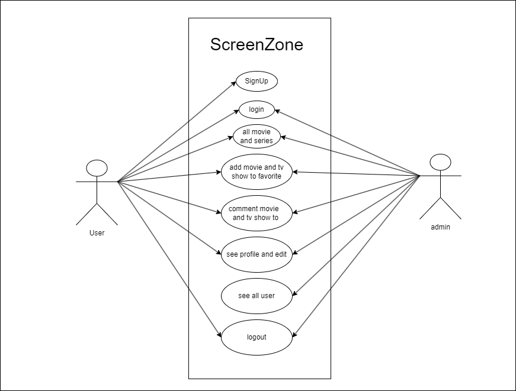

# ScreenZone Portal

## Description

ScreenZone is a web application designed to manage and display a list of movies and Tv show. It allows users to add their own ratings and reviews for each movie or Tv show. The application provides an Page for users to navigate through the movie/Tv show list.

## Class Diagram

## Setup

1. Clone the repository to your local machine.
2. Run `npm install` to make sure you get all things  
3. Set up the back-end from [ScreenZone Api](https://github.com/nawafaotayf/showslist-api)
4. Run the application after back-end
   
## Technologies Used
- **Visual Studio**: This is the integrated development environment (IDE) used for the project. It provides comprehensive facilities to computer programmers for software development.
- **Angular**: This is the web application framework used. It's a platform for building web applications in HTML and either JavaScript or a language like TypeScript that compiles to JavaScript.
- **Bootstrap**: This is the most popular CSS Framework for developing responsive and mobile-first websites. It's used for designing the user interface in this project.

## Pages
1. Login/SignUp page
2. Home Page
3. Movie/Tv shows Page
4. Movie/Tv shows details page including adding rating and comment.
5. Profile Page including edit profile
6. Alluser page for admin only.
   
## Extra Links
- [Trello Board](https://trello.com/invite/b/jDP6CrCp/ATTIc883f6c291416b9ff4c234672e1559da8A26E0B0/shows-list)
- [Presentation](https://docs.google.com/presentation/d/1MAeHkpOcHL-RgdyD2i5E3QJT28XKJNGuchqMLxYpn64/edit?usp=sharing)
## Future Work
In the future, I plan to extend this project in several ways:

1. **Enhance the design:** I plan to improve the user interface and user experience of the application.

2. **Recommendation System:** I want to implement a recommendation system that suggests movies or series to users based on their viewing history and ratings.
## Resources
- [Bootstrap](https://getbootstrap.com/)
- [Angular Doc](https://angular.io/start)
- [Stack OverFlow](https://stackoverflow.com)
